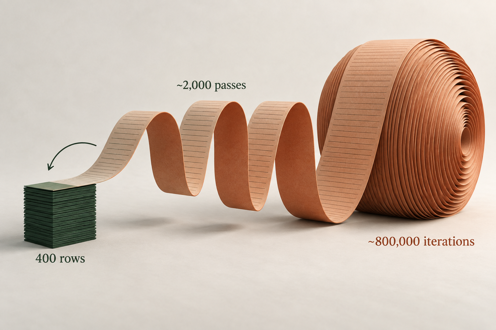
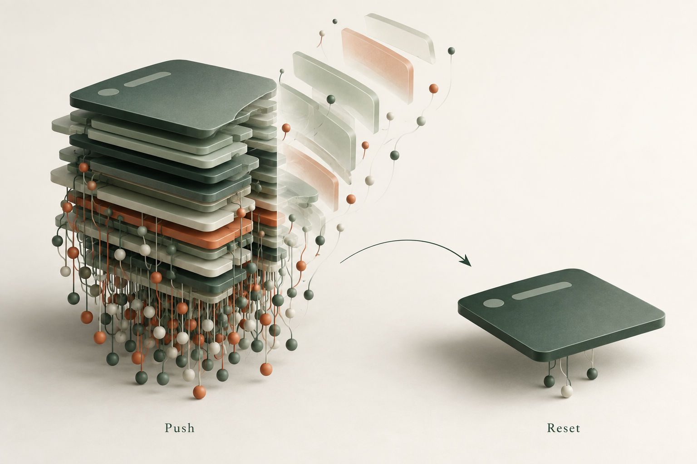
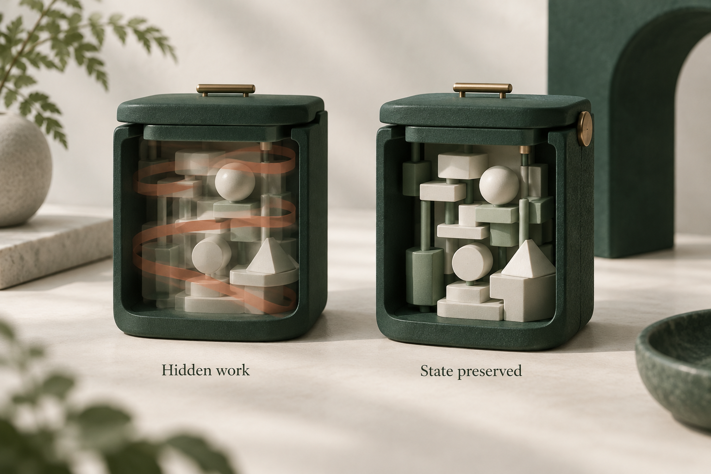
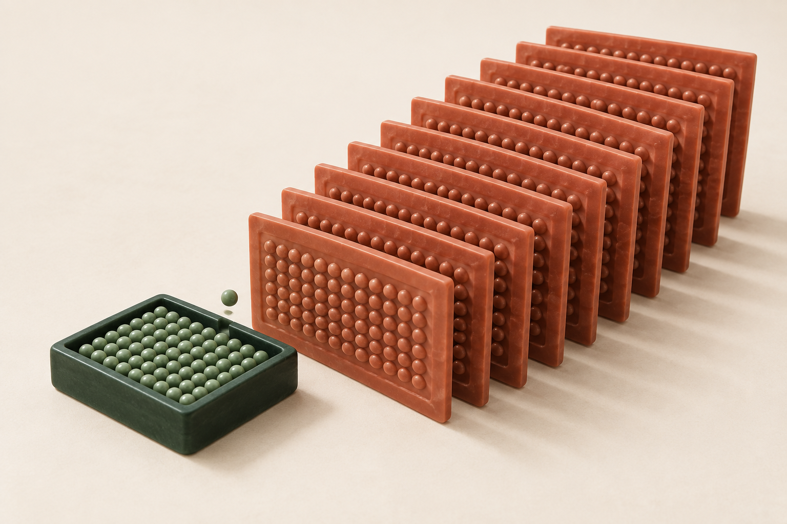
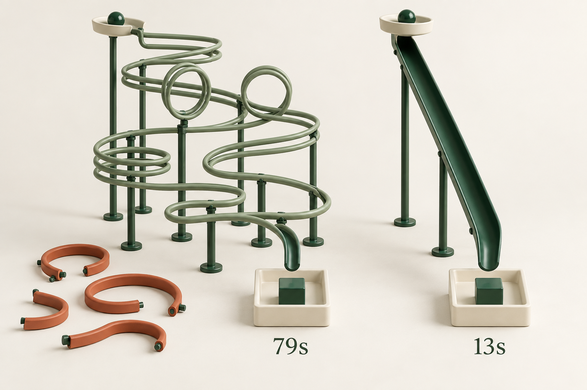

# Small changes, big performance wins

Adding an ID. Resetting a navigation stack. Moving a calculation up one level. Isolating a tiny import.

Some of our biggest performance wins at Handoff came from changes like these. Obvious in hindsight. Harder to spot when each piece of code looks reasonable on its own.

Here are six memorable ones from the last year across our backend and our [universal React Native app](https://www.handoff.ai/tech/shipping-a-universal-expo-app-to-web-ios-and-android-in-production-lessons-from-handoff). Plus a TypeScript DX bonus.

## 1. Count the calculations, not just the queries

A 400-row estimate could cause roughly **800,000 row iterations**. Several GraphQL fields recalculated the whole estimate's breakdown for each row: about 2,000 calculations, each walking 400 rows.

On small projects with 30–60 rows, this wasn't obvious. Full-house estimates with 300–400 rows exposed it: repeated calculations hammered the server's JS thread and slowed unrelated requests. That's the danger of quadratic work. Ten times the rows can mean a hundred times the work.

We calculated the estimate once, loaded the supporting data in batches, and reused the results for each row. Totals, rounding, and zero values still had to hold up.

Count calculations as well as database calls. Caching a query doesn't stop you from processing its result thousands of times. Neither does making the function async.

## 2. One missing ID, a waterfall of requests

We already had the data. But some GraphQL responses were missing an entity's `id`, so Apollo couldn't reliably connect them to what it had cached.

Auth, navigation, permissions, and billing would fetch again. One missing ID caused a cascade of work that shouldn't have happened.

We added IDs to queries and manual cache writes, alongside query and fetch-policy fixes. Fewer unnecessary requests, less repeated work, and less pressure on the server.

Check the lint rules for your tools. GraphQL ESLint's [require-selections](https://the-guild.dev/graphql/eslint/rules/require-selections) catches missing `id` selections when the type has one. We enabled it. A simple lint error would have saved a lot of this headache.

## 3. Native stacking didn't translate well to web

During longer web sessions, everything started to crawl. On mobile, stacking screens works naturally: you open a screen, then go back, popping it off the stack.

Our web app used the same React Navigation stack, but people moved between pages through the sidebar. Those links used `router.push()`. Even going home added a page instead of clearing the old stack. Screens and their observers kept accumulating. On native, [`enableFreeze()`](https://reactnavigation.org/docs/stack-navigator/#freezeonblur) reduced rendering, but didn't release subscriptions.

We had to clear the stack explicitly when a main root page became visible. Removing those trees released their observers. One local comparison dropped from **3,671 query observers to 298**, with the same **105 cache objects**.

The native pattern was useful, but our web navigation needed different cleanup.

## 4. Render less, less often

A lot of React performance comes down to this: render less, less often. Only do the work the current interaction needs.

Our closed dialogs and bottom sheets kept their forms mounted, which preserved state. Even with [React Compiler](https://react.dev/learn/react-compiler), those trees can still rerender when state or context changes, while nobody is using them. We used [react-freeze](https://github.com/software-mansion/react-freeze) to pause rendering without unmounting them: keep the state, resume before opening.

The UI already worked. This made it cheaper to keep around. That's often the game with React performance: give it less to do.

## 5. A small PostHog queue, a lot of JS work

PostHog's React Native storage was keeping **200 events, about 1.86 MB**. Small enough. But adding one event could turn the whole cache into JSON again and write it to storage.

One new event, another copy of everything. During bursts, those copies piled up faster than writes finished. Profiling found **284 large strings accounting for roughly 1.06 GB**.

We removed duplicate feature-flag events, cut the queue to 30, and kept only the latest copy waiting to be written. That didn't eliminate every JSON conversion, but it reduced the data being processed and the copies kept alive. The smaller queue also means losing older analytics events sooner when offline.

Follow what happens after an append. A small queue can still create a lot of work if every change rewrites the whole thing.

## 6. The dark side of DOM components

A single import can bring a whole chain of app code into a DOM bundle. Our editor needed a tiny underline helper. Importing it from a shared module pulled in GraphQL, telemetry, and their dependencies too.

Don't assume the bundler will strip everything you aren't using. [Expo Atlas](https://docs.expo.dev/guides/analyzing-bundles/) showed what actually got included. We isolated the helper and removed unnecessary `use dom` directives. Together, those changes reduced reported DOM bundle output from **27.6 MB to 1.7 MB**.

Keep these imports small and self-contained. Sometimes duplicating a few lines is better than dragging a much larger bundle along with them.

## Bonus: 53 million fewer type instantiations

We had already moved to Go-based TypeScript, and a cold check still took **79 seconds**. Microsoft's [TypeScript 7 benchmarks](https://devblogs.microsoft.com/typescript/announcing-typescript-7-0/) had VS Code building in about 10 seconds. If VS Code could do that, why was our Node server taking over a minute just to check types? That was worth digging into.

_Our before-and-after: cold checks on the same setup, single-threaded TypeScript 7.0.2. Microsoft's VS Code benchmark used four checker workers on a different setup._

Our Prisma types described configurations we didn't use. Narrowing them in just a few files brought that same check down to **13 seconds**, with **53 million fewer type instantiations** and identical JavaScript. With a warm cache, small edits can type-check in about **2 seconds**.

That's a big win for AI coding too. Less waiting between editing and checking means a much better feedback loop. Check `--extendedDiagnostics` before accepting slow checks as normal. Even a faster compiler benefits from less work.

## The small wins add up

These are some of the most memorable ones. But performance is often death by a hundred paper cuts: a missing database index, another observer, another hidden render, another copy of the same data. Each looks harmless until they add up.

We chip away at it whenever we can. There are hundreds of smaller fixes across the team: one less render, a tighter query, less work on the JS thread. That steady work shapes how the product feels every day.

Not all fast software is good, but [all good software is fast](https://x.com/tobi/status/1787139157078188180). Contractors should be able to get their work done without waiting on ours.

That's the standard we strive for at Handoff.
